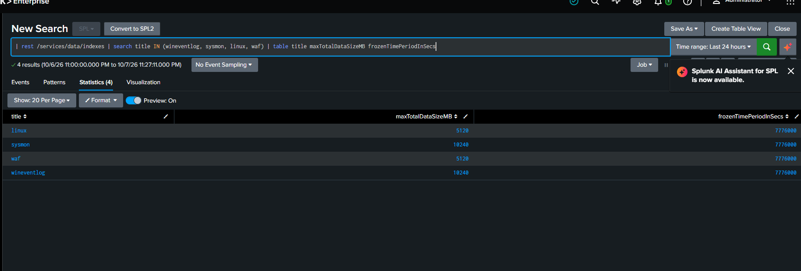
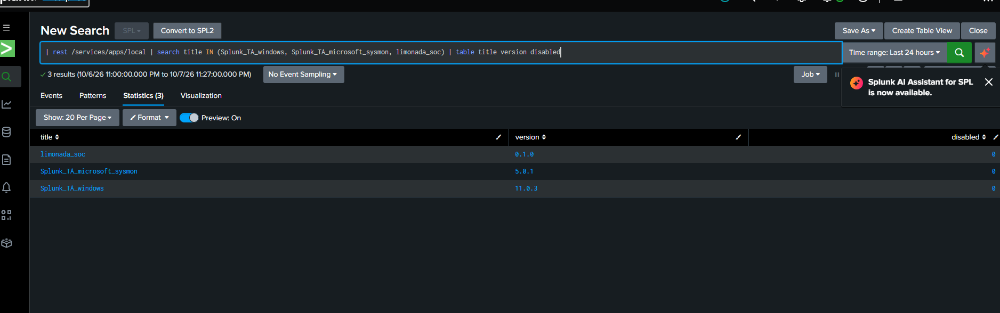
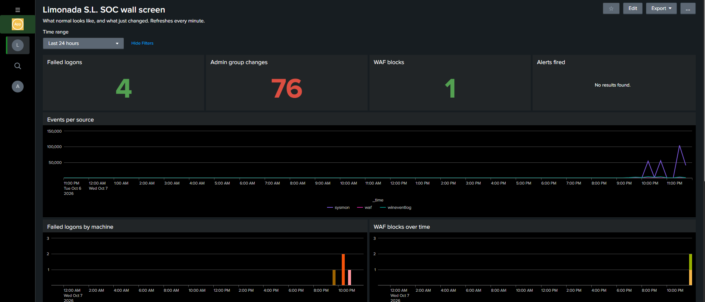
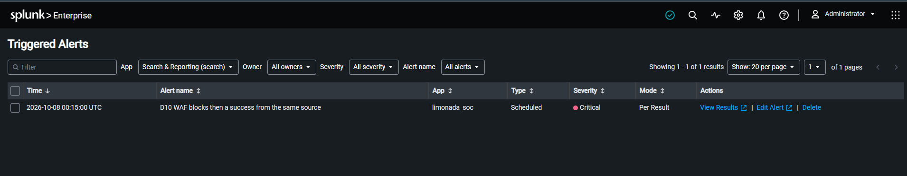
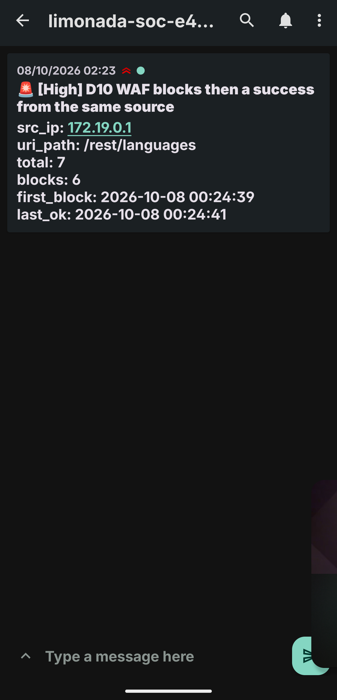

# SOC in a Box

I built a tiny company on my PC, put a security operations center next to it, and then broke into my own company to see if I'd catch myself.

> **Status:** building. The company and the SOC are up, and 6 of 10 detections are live.

## What this is

**In simple words:** picture a small office with a server that checks everyone's logins, a couple of staff laptops and a web shop. Every one of them sends a note to a camera room each time something happens. I sit in the camera room. Then I play the burglar, break in a few different ways, swap hats, and try to catch myself the way a SOC analyst would on a real shift.

**In technical words:** a Windows Server domain controller, two Windows 11 workstations and a web server with a WAF run on my PC. Their Windows Security, Sysmon, PowerShell, Linux and ModSecurity logs leave the lab network and travel to Splunk Enterprise and Wazuh, which run in Docker on the same PC but outside the company's network. I run MITRE ATT&CK techniques against the lab with Atomic Red Team, my SPL detections raise alerts that buzz my phone, and I work every alert into a written incident report.

## About me

I'm Albeen. I'm studying network systems administration and I want to start my career as a SOC analyst. Before this I did a CyberSOC trainee program and guided Elastic and Kibana labs, and I built [WAF Flight Recorder](https://github.com/albeen-sknight/waf-flight-recorder), a web application firewall I deployed, attacked and tuned myself.

## Why I built it

In guided labs someone else builds the company, plants the attack and hands you the logs. I wanted the whole shift, start to finish:

- **Collect the logs** from machines I set up myself.
- **Watch them** on a dashboard that sits on a tablet like a wall screen.
- **Write the detections** and map each one to MITRE ATT&CK.
- **Work the alerts**: triage, investigate, write the report, tune the noisy ones.

Every alert here comes from an attack I ran on purpose, so I can explain the whole chain, from the command to the log line to the alert.

## The company: Limonada S.L.

Limonada S.L. is a made up juice distributor with 40 staff. It's the same company that runs the web shop I protected in my WAF project, so the two projects tell one story.

| Machine | What it is | Lives on |
| --- | --- | --- |
| DC01 | Windows Server 2025, the domain controller for `limonada.local` | PC |
| WS01, WS02 | Windows 11 Enterprise staff workstations | PC |
| WEB01 | The web shop behind the WAF from my last project | PC |
| Attacker | The uninvited guest, aimed only at lab machines | PC |
| The SOC | Splunk, Wazuh and the alert relay in Docker, outside the lab network | PC |
| The pager | Alerts arrive as phone notifications | Phone |
| The wall screen | The SOC dashboard, full screen | Tablet |

The company lives on a private VMware network and the SOC lives outside it, in Docker. That's how a managed SOC works in real life too: it sits outside the client's network and the logs travel to it.

## The build, phase by phase

| Phase | What happens | Status |
| --- | --- | --- |
| 0 | Groundwork: virtualization, the repo, the Windows ISOs | Done |
| 1 | The SOC comes up: Splunk in Docker | Done |
| 2 | Build the company: the domain, the staff, the logging, Sysmon | Done |
| 3 | Onboard every log source: the forwarders | Done for Windows; WEB01 next |
| 4 | WEB01 and the SOC dashboard | Done |
| 5 | Ten detections and the pager | In progress: pager done, 6 of 10 detections live (D01, D03, D04, D07, D08, D10) |
| 6 | The compressed week of attacks | Not started |
| 7 | Work the alerts like a shift | Not started |
| 8 | The second SIEM: Wazuh | Not started |
| 9 | Detection tests and this handbook | Not started |

## See it working

The lab isn't a drawing, it runs. Here's the shift so far, in the order I built it.

**The SOC comes up.** First I needed somewhere for the logs to land. Splunk runs in Docker on my PC, with four buckets ready: one for Windows events, one for Sysmon, one for the web shop, one spare for Linux.

*The four indexes, waiting for logs.*

Raw Windows events are a wall of numbers, so Splunk needs two small apps to make sense of them. Here they are, installed.

*The two Splunk apps that turn raw event codes into readable fields.*

**Logs from the company.** Once the machines had their forwarders, the events started arriving on their own.

*DC01, WS01 and WS02 sending their logs to the SOC.*

**The dashboard.** This is what I look at when I sit down: failed logins, admin changes, WAF blocks, all on one screen.

*My camera room. One glance tells me if something looks off.*

**An attack, start to finish.** Then I played the burglar. Someone hammered the web shop with bad requests, the WAF blocked them, and a minute later my detection fired.

*Many WAF blocks, then a success from the same source. The alert caught the pattern.*

A SOC analyst isn't always at the desk, so the same alert buzzed my phone.

*The same alert, on my phone, seconds later.*

**It pages for more than one thing.** The pager catches more than one kind of attack. Here it flags someone added to an admin group, and someone wiping a machine's security log.

*Someone got put in the Administrators group. High priority.*

*Someone cleared WS02's security log. Critical, and the SOC still kept every event the machine sent before the wipe.*

## How I learned it

I'm still learning, so I built this the way a lot of people learn now: with Claude Code, an AI coding assistant, as my tutor. It helped me script the lab (the domain build, the configs, the first drafts of the detections), and I used it to learn the job: I ran Limonada S.L. on my own machines, worked every alert, wrote every incident report and compared Splunk with Wazuh myself.

Think of a driving instructor with dual controls. The instructor helped get the car on the road; I'm the one learning to drive it.

## What I learned

_I'll write this part myself once the shift is over._

## Limits

This is a training lab for one analyst, not real security for a real company. The attack week is compressed: five simulated days run in about an hour and a quarter, with normal staff activity playing in the background. It isn't Splunk Enterprise Security or a 24/7 service; everything here is what a junior analyst does by hand.

Every name in this lab is made up, and no real IP addresses or usernames appear in the screenshots.
