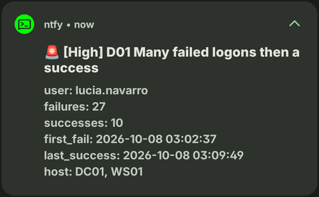

# SOC in a Box

I built a tiny company on my PC, put a security operations center next to it, and then broke into my own company to see if I'd catch myself.

> **Status:** finished. The company and the SOC are built and running, and all ten detections are done. Nine fire on a real attack and page my phone; the tenth ran into a defense that stops the attack before it even starts, which is a win in its own right. This page is the whole story, start to finish.

## What this is

**In simple words:** picture a small office with a server that checks everyone's logins, a couple of staff laptops and a web shop. Every one of them sends a note to a camera room each time something happens. I sit in the camera room. Then I play the burglar, break in a few different ways, and try to catch myself the way a SOC analyst would on a real shift.

**In technical words:** a Windows Server domain controller, two Windows 11 workstations and a web server with a WAF run on my PC. Their Windows Security, Sysmon, PowerShell and ModSecurity logs leave the lab network and travel to Splunk Enterprise, which runs in Docker on the same PC but outside the company's network. I run techniques mapped to MITRE ATT&CK against the lab, my SPL detections raise alerts that buzz my phone, and I work every alert the way a junior analyst would.

## About me

I'm Albeen. I'm studying network systems administration and I want to start my career as a SOC analyst. Before this I did a CyberSOC trainee program and guided Elastic and Kibana labs, and I built [WAF Flight Recorder](https://github.com/albeen-sknight/waf-flight-recorder), a web application firewall I deployed, attacked and tuned myself. That project is the web shop in this one.

## Why I built it

I want to work as a SOC analyst, the person in the chair who watches the alerts, decides which ones are real and runs down the ones that are. The trouble with learning that from guided labs is that someone else has already built the company, planted the attack and handed you the clean logs. You end up practising how to read the answer, not how to find it.

So I built the whole thing myself. I set up the company, a small Windows domain with staff, workstations and a web shop. I stood up the SOC next to it and wired every machine to send its logs across. I wrote the detections and mapped each one to MITRE ATT&CK. Then I played the attacker, ran each technique on purpose, and sat in the chair to see whether my own alerts would catch me.

This is the second half of a story I started with [WAF Flight Recorder](https://github.com/albeen-sknight/waf-flight-recorder), where I built and attacked a web firewall. That firewall is the web shop here, WEB01, and its logs flow into this SOC. One company, two projects, one story: the firewall blocks the attack, the SIEM notices the pattern.

The point was never to collect ten working searches. It was to understand the whole chain, from the command an attacker types, to the log line it leaves, to the alert on my phone, so I can explain any piece of it out loud. That's the part of the job you can't fake in an interview.

## The company: Limonada S.L.

Limonada S.L. is a made up juice distributor with 40 staff. It's the same company that runs the web shop I protected in my WAF project, so the two projects tell one story.

| Machine | What it is | Lives on |
| --- | --- | --- |
| DC01 | Windows Server 2025, the domain controller for `limonada.local` | PC |
| WS01, WS02 | Windows 11 Enterprise staff workstations | PC |
| WEB01 | The web shop behind the WAF from my last project | PC |
| Attacker | The uninvited guest, aimed only at lab machines | PC |
| The SOC | Splunk and the alert relay in Docker, outside the lab network | PC |
| The pager | Alerts arrive as phone notifications | Phone |

The company lives on a private VMware network and the SOC lives outside it, in Docker. That's how a managed SOC works in real life too: it sits outside the client's network and the logs travel to it.

## The SOC comes up

Think of the SOC as a warehouse that only takes in deliveries once it has the right loading bays. First I needed somewhere for the logs to land. Splunk runs in Docker on my PC, with four buckets ready: one for Windows events, one for Sysmon, one for the web shop, one spare for Linux.

Raw Windows events are a wall of numbers, so Splunk needs two small apps to make sense of them. Here they are, installed.

Once the machines had their forwarders, the events started arriving on their own, from the domain controller and both workstations.

This is the screen I look at when I sit down: failed logins, admin changes, WAF blocks, all in one place.

## The ten detections

Each detection is a saved SPL search that runs every minute over the last fifteen, mapped to a MITRE ATT&CK technique. The serious ones page my phone. The quieter ones sit on the dashboard as context, so the pager stays meaningful. Each one below has a full write up in [`detections/`](detections) with the search, the false positives, what it misses and how I tested it.

| # | Detection | ATT&CK | Severity | Status |
| --- | --- | --- | --- | --- |
| D01 | [Many failed logons then a success](detections/D01-failed-logons-then-success.md) | T1110 | High, pages | Fires, paged |
| D02 | [Password spray from one source](detections/D02-password-spray.md) | T1110.003 | High, pages | Fires, paged |
| D03 | [Added to a privileged group](detections/D03-added-to-admin-group.md) | T1098 | High, pages | Fires, paged |
| D04 | [New local account created](detections/D04-new-local-account.md) | T1136.001 | Medium | Fires |
| D05 | [Encoded or hidden PowerShell](detections/D05-encoded-powershell.md) | T1059.001 | High, pages | Fires, paged |
| D06 | [A process opening LSASS memory](detections/D06-lsass-access.md) | T1003.001 | Critical, pages | Built, blocked by a defense |
| D07 | [New scheduled task](detections/D07-new-scheduled-task.md) | T1053.005 | Medium | Fires |
| D08 | [Security log cleared](detections/D08-security-log-cleared.md) | T1070.001 | Critical, pages | Fires, paged |
| D09 | [Office starting a shell](detections/D09-office-spawns-shell.md) | T1204.002 | High, pages | Fires, paged |
| D10 | [WAF blocks then a success](detections/D10-waf-blocks-then-success.md) | T1190 | High, pages | Fires, paged |

I'll walk them in the order an intruder would actually trip them, from knocking on the door to covering their tracks.

### Getting in

**D01, many failed logons then a success.** Picture someone sitting at a keyboard typing the wrong password for a staff account over and over, then finally getting it right. That's what this catches: ten or more failures on one account, then a success. On my test it was `lucia.navarro`, 27 failures then a login, and a minute later my phone buzzed.

Building it turned up my first real finding: `limonada.local` has no account lockout policy. Nothing stops the guessing after ten tries, so this alert is the only thing watching that door. I wrote that down rather than quietly fixing it, because noticing the gap is the job.

**D02, a password spray.** This is D01 turned around. Instead of many passwords against one account, it's one password tried against many accounts, which is how an attacker dodges a lockout. I sprayed 15 accounts from WS01 in a few seconds, and the detection pulled it into one row: one source, 15 different accounts, over the threshold.

### Taking hold

Once someone is in, they make themselves at home: more rights, a spare way back in, something that survives a reboot.

**D03, added to a privileged group.** This is the moment an intruder stops being a guest and gives themselves the keys. It watches three events, not one, because adding to the local Administrators, Domain Admins and Enterprise Admins groups each log differently. Add an account to admins and my phone goes off.

**D04, a new local account.** On a company PC people sign in with domain accounts. A brand new local one is the classic quiet way back in, because it doesn't show up in Active Directory. On its own a new local account is often innocent, so this one is Medium and sits on the dashboard. The dangerous version, a new account that then gets admin rights, is what D03 pages for.

**D07, a new scheduled task.** A scheduled task is one of the easiest ways to make something run again after a reboot, so attackers love them. The trick I'm proud of here is filtering on *who*, not *where*. Windows makes its own tasks as the computer account, so leaving those out removes all the noise while still catching a task a person hides, even inside a Windows folder.

### Running code they shouldn't

**D05, encoded or hidden PowerShell.** Malware rarely runs a plain readable command. It hides the payload behind base64 or a hidden window. This one catches both, and it taught me the hardest lesson of the project. My first version returned zero rows right after I'd clearly run the attack, which felt like the detection was broken. It wasn't. The data was there, I was reading the wrong field for it. Twice. The command line sat in `Process_Command_Line`, not `CommandLine`, and the PowerShell script text sat in `Message`, not `ScriptBlockText`. Once I pointed the search at the right fields, all of it showed, and it paged.

The lesson stuck: a detection that returns nothing right after you attacked usually means you're reading the wrong field, not that the attack was quiet. I now check the field before I trust the logic.

**D09, Office starting a shell.** You open an invoice, a macro fires, and Word quietly launches a command prompt. A normal document never does that, so Word or Excel as the parent of a shell is a strong signal. Office isn't installed on these machines, so I proved the logic with a stand in: I copied `cmd.exe` to a file named `winword.exe` and had it spawn a shell. The detection caught it and paged, with the fake `winword.exe` as the parent and `cmd.exe` as the child. It reads two log sources, Security 4688 and Sysmon event 1, so it still catches the spawn even when one of them misses it.

### After the keys

**D06, a process opening LSASS memory.** This is the big prize for an attacker: LSASS is the Windows process that holds everyone's signed in credentials, and reading its memory is how tools like Mimikatz steal passwords. This is the one detection that didn't fire, and that turned out to be the best story in the project.

I wrote a small test that asks Windows for a read handle to LSASS, the exact access a dumper needs, without reading a single byte of memory. It was denied. I ran it elevated. Denied. I ran it elevated with the debug privilege that dumpers rely on. Still denied. The reason was in the registry: `RunAsPPL = 2`. LSASS on these machines runs as a protected process with a UEFI lock, which means the kernel refuses the handle before anything can touch it. Mimikatz, comsvcs and ProcDump all hit the same wall.

So D06 is built and correct, but on these hosts the operating system stops the attack upstream, and the refused attempt is so early that it doesn't even log an event for the detection to catch. I found a working defense, not just a working detection, and that is a better outcome. The detection still earns its keep on any host without that protection, or against an attacker who tries to switch it off first, which is loud in its own right.

### Covering tracks

**D08, the security log cleared.** The last thing an intruder does is wipe the logs. Almost nothing legitimate clears a machine's Security log, so when it happens it pages at Critical. The part I like: clearing the log on the machine doesn't touch what the SOC already has. I cleared WS02's log at the end of a test, and Splunk still held every event the machine had sent before the wipe, plus the one event that a clear always writes, saying who did it.

That's the whole point of sending logs off the machine: you can't delete what already left.

### The web shop

**D10, WAF blocks then a success.** This is the bridge to my last project. WEB01 is the WAF Flight Recorder, and its firewall log flows into the same SOC. The detection watches for many blocks from one source on one page, then a success on that same page, which is the shape of an attacker hammering a form until something gets through. A burst of blocks from one IP, then a 200, and it pages.

## The pager

Alerts are no use if I'm not staring at the screen, so the serious ones come to my phone. A Splunk alert calls a small relay I wrote, which forwards it to a private [ntfy](https://ntfy.sh) topic that my phone is subscribed to. Only High and Critical page; Medium detections stay on the dashboard so the phone only buzzes for things worth standing up for. The topic name is a secret kept out of the repo, so nobody else can read my alerts.

## What I found

The detections are the point, but the findings along the way are what I'd actually talk about in an interview.

- **No account lockout policy.** The domain never locks an account after bad passwords, so guessing and spraying are cheap. D01 and D02 are the only thing watching that door.
- **LSASS is protected, and it works.** `RunAsPPL = 2` with a UEFI lock stops credential dumping before it starts, and so early that the attempt leaves no trace. A real defense beating a real technique, found by testing.
- **Central logging survives a wipe.** Clearing a machine's log doesn't touch what the SOC already holds. D08 proved it.
- **The sensor had blind spots, and the fields weren't where I expected.** LSASS access wasn't being logged in a useful way until I looked, and the event fields on these machines weren't the Windows defaults. Checking what the data actually looks like, before trusting a search, is now the first step of every detection I write.

## How I learned it

I'm still learning, so I built this the way a lot of people learn now: with Claude Code, an AI coding assistant, as my tutor. It helped me script the lab, the domain build, the configs and the first drafts of the detections. I used it to learn the job, not to skip it: I ran Limonada S.L. on my own machines, ran every attack, debugged every detection that came back empty, and worked out the findings myself.

Think of a driving instructor with dual controls. The instructor helped get the car on the road; I'm the one learning to drive it.

## What this taught me

Building this did more for me than any course module, because nothing here worked on the first try and I had to understand why.

- **I can read Windows telemetry.** I know what a 4625, a 4688, a 4104, a 4698 and a 1102 are telling me, and I learned the harder lesson that the field you want isn't always where you expect. Twice a detection came back empty right after I'd clearly attacked, and both times the data was there, just in a field I wasn't reading. Checking the raw event before trusting the search is a habit now, not a step.
- **I can take an attack, map it to ATT&CK and build a detection for it.** Every one here has a technique ID, so I can describe what it catches in the language a SOC team actually uses.
- **I learned the difference between a detection firing and a detection mattering.** D06 is the clearest case: the search is correct, but the host's own protection stops the attack before it can be seen. Finding that was worth more than a green alert.
- **I learned to tune for signal.** Filtering on who made a change rather than where, suppressing repeats, and keeping the quiet detections off the pager so the loud ones still mean something. A pager that cries wolf gets ignored, and that is a real way a SOC fails.
- **I practised the mindset.** Noticing the missing lockout policy, proving that central logging survives a wipe, writing the gaps down instead of quietly papering over them. That instinct is the thing I most wanted to build, and it's the thing an intern is actually hired to start learning.

This doesn't make me a finished analyst. It makes me someone who has done the work with their own hands and can talk through every piece of it, which is where I want to be starting from.

## Where I'd take it next

The ten detections are the heart of this, and they're done. If I keep building on it, the road is already mapped:

- A compressed attack week: five incidents fired fifteen minutes apart over ordinary background traffic, each one worked and written up as an incident report.
- Wazuh as a second SIEM running the same week, so I can compare it with Splunk side by side.
- A short Microsoft Sentinel sprint to port a few detections into a third query language.

None of that changes the core, which is here and working today.

## Limits

This is a training lab for one analyst, not real security for a real company. It's a handful of virtual machines on one PC, not a hardened network, and the SOC is one person working by hand, not Splunk Enterprise Security or a 24/7 team. The worth of it is in the building and the understanding, not in the scale.

Every name in this lab is made up, and no real IP addresses or usernames appear in the screenshots.
