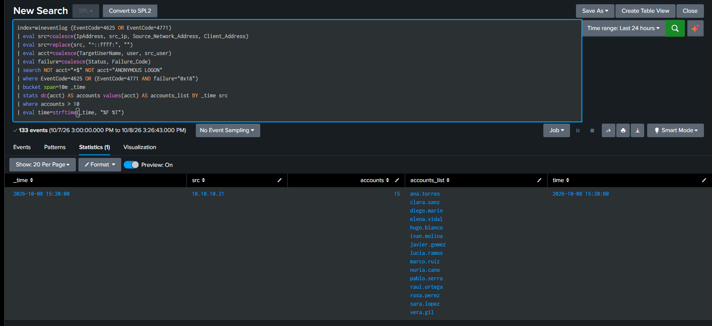
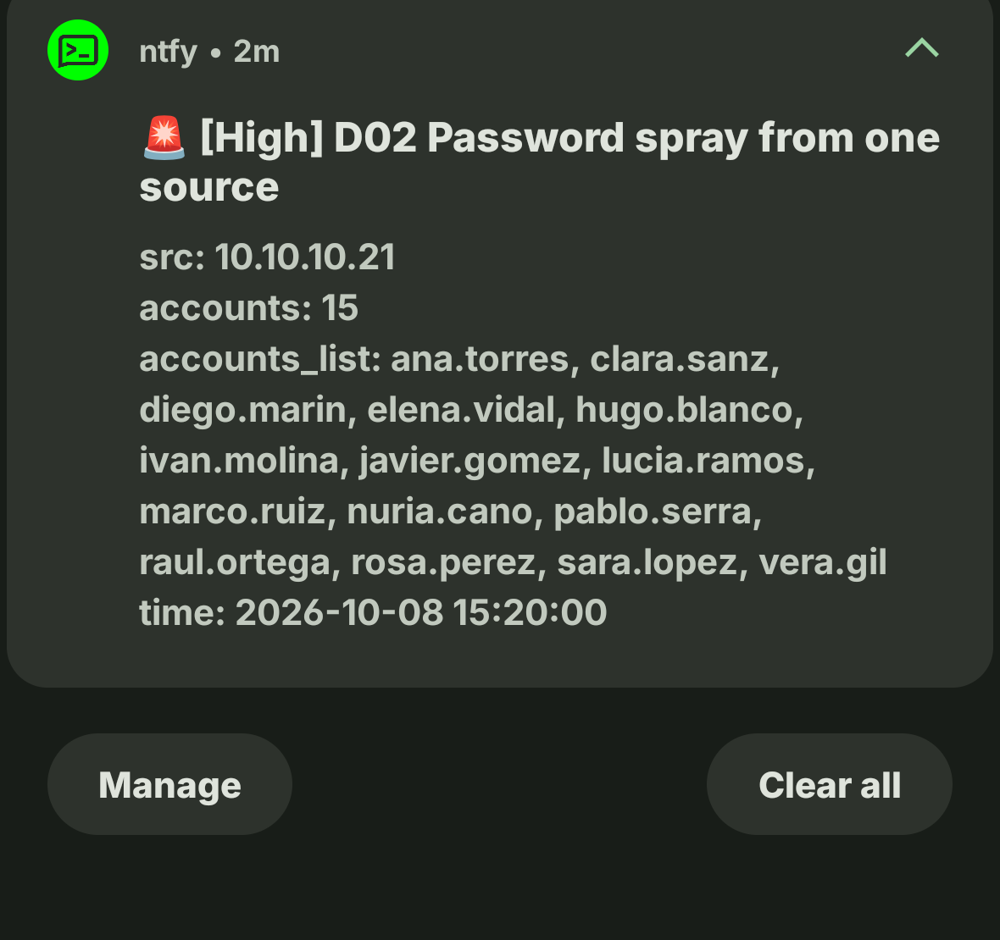

# D02: Password spray from one source

**ATT&CK:** T1110.003 Password Spraying
**Severity:** 4 High, pages
**Source:** Security 4625 (workstations), 4771 (DC01), index=wineventlog

## What it catches

One machine failing to log in against many different accounts in a short window. This is the reverse of D01: D01 is one account hit with many passwords, D02 is one source trying one password against many accounts to dodge lockouts. limonada.local has no lockout policy, so this detection is the only thing watching that door.

## The search

```
index=wineventlog (EventCode=4625 OR EventCode=4771)
| eval src=coalesce(IpAddress, src_ip, Source_Network_Address)
| eval acct=coalesce(TargetUserName, user, src_user)
| search NOT acct="*$" NOT acct="ANONYMOUS LOGON"
| where EventCode=4625 OR (EventCode=4771 AND Status="0x18")
| bucket span=10m _time
| stats dc(acct) as accounts values(acct) as accounts_list by _time, src
| where accounts > 10
| eval time=strftime(_time, "%F %T")
```

## What a false positive looks like

In a lab this size, nothing legitimate touches 10 different accounts from one source in 10 minutes. On a real network, a few things could:

- A vulnerability scanner doing credential checks. It hammers many accounts from one box, which is exactly the shape this looks for. Check whether the `src` is a known scanner before you treat it as an attack.
- A misconfigured service account retrying a stale password. After a password change that didn't get updated everywhere, one server can fail against a spread of accounts as each service tries to authenticate. The giveaway is that it's the *same* source failing over and over, often on a timer.
- A VPN or gateway box reconnecting a batch of sessions at once, so DC01 sees a burst of failures all sourced from that one appliance.

The `accounts_list` field is how I tell these apart. A scanner or a stuck service tends to hit the same predictable set each time. A spray walks through a username list I don't recognise.

## What it misses

- **A slow spray.** An attacker who stays under 10 accounts per 10-minute window slips straight through the threshold. That's exactly how a careful one throttles: a few tries, wait, a few more. Catching that needs a longer window or a running daily count per source, which is its own detection.
- **Sprays over protocols that don't raise 4625 or 4771.** Some LDAP binds, and auth against apps that don't log to the Security channel, never produce either event, so this search never sees them. This search watches Windows logons, not every kind of auth.
- **A spray spread across several sources.** If the attacker rotates through a handful of machines, each one can stay under the threshold while the campaign as a whole is loud. This groups `by src`, so it won't join those up.

## How I tested it

Took a snapshot of WS01 first (`clean - six detections`) so I could roll everything back.

From WS01, as a normal user, I ran a `net use` loop against DC01 (`10.10.10.10`): 15 made-up usernames, one password (`Autumn2026!`), each one failing on purpose. That's 15 failed logons from a single source in a few seconds, well over the threshold of 10.

Each attempt wrote a 4625 on WS01 and a 4771 on DC01, so both halves of the search had data. The detection returned one row: WS01 as `src`, the account count above 10, and the 15 names in `accounts_list`. Zero rows before the spray, which is the "doesn't fire on a quiet network" check.

Afterwards I reverted WS01 to the snapshot to clear the test out.

Here it is firing on the spray, one row with WS01 as the source and all 15 names:



And the page it sent to my phone:



## The incident that proved it

None yet.
