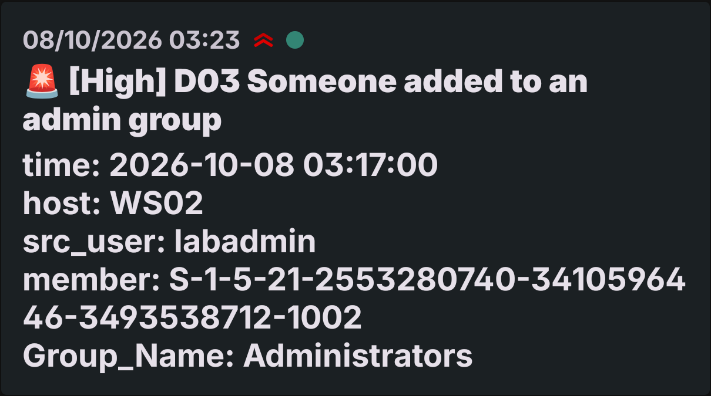

# D03: Someone added to a privileged group

**ATT&CK:** T1098 Account Manipulation
**Severity:** High (pages)
**Source:** `index=wineventlog`, events 4728, 4732, 4756

## What it catches

A person adding an account to Administrators, Domain Admins or Enterprise Admins.

That's the moment an intruder stops being a guest. Whatever they did to get in, this is where they give themselves the keys.

I watch three events, not one. 4732 only covers local groups like Administrators. Domain Admins changes are logged as 4728 (global group), and Enterprise Admins as 4756 (universal group). With 4732 alone, two of the three groups in my list could never match.

## The search

```
index=wineventlog (EventCode=4728 OR EventCode=4732 OR EventCode=4756)
    Group_Name IN ("Administrators", "Domain Admins", "Enterprise Admins")
    NOT src_user="*$" NOT src_user="ANONYMOUS LOGON"
| eval member=coalesce(Member_Security_ID, member_id)
| table _time host src_user member Group_Name
```

- `NOT src_user="*$"` drops changes made by computer accounts: Windows filling its own groups during setup. That's TJ-001.
- `NOT src_user="ANONYMOUS LOGON"` drops the rows from when the domain was being created.
- `member` is there because the `user` column was empty on every row. Without it, the alert tells you who granted access but not who got it.

## What a false positive looks like

The member SID tells you most of the story. Look at the last number, the RID:

- **`-512` is Domain Admins**, added to a PC's local Administrators group. That happens on every domain join, under the account doing the join. **Expected right after a join.** I'm keeping it on purpose: joins are rare, and one I didn't plan is worth waking up for. If it gets noisy, I'd leave out `-512` only when the group is the local Administrators group, nothing wider.
- **`-1150` was `adm.carlos.ruiz`** being put in Domain Admins by the build script. Legitimate, but it's exactly the kind of change this should page for, so it shows up in the search, which is correct.
- IT granting someone admin for a real reason. Check for a ticket.

## What it misses

- Changes made as SYSTEM. They log the computer account as the subject, so the `$` filter hides them. An attacker who already has SYSTEM can add an admin without this firing.
- A user account named to end in `$`, like `svc$`. Windows allows it, and the filter hides it.

## How I tested it

On WS02, as `.\labadmin`:

```powershell
New-LocalUser -Name "helpdesk.temp" -NoPassword -Description "SOC test account"
Add-LocalGroupMember -Group "Administrators" -Member "helpdesk.temp"
```

It came back as one new row: WS02, `labadmin` → Administrators, member SID ending in **`-1002`**, a new local account.

And my phone got the page:



## The incident that proved it

None yet. Tested on purpose, not caught in the wild.
