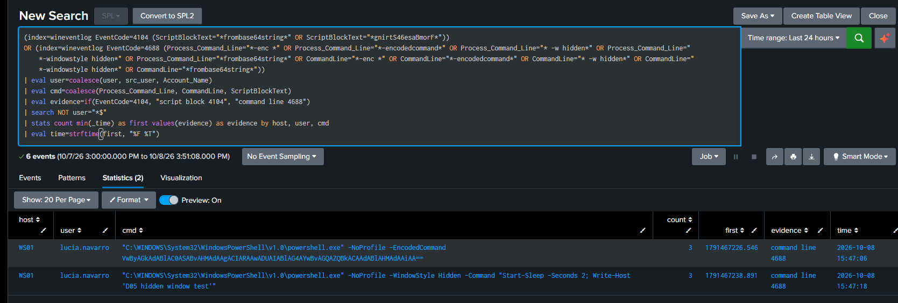
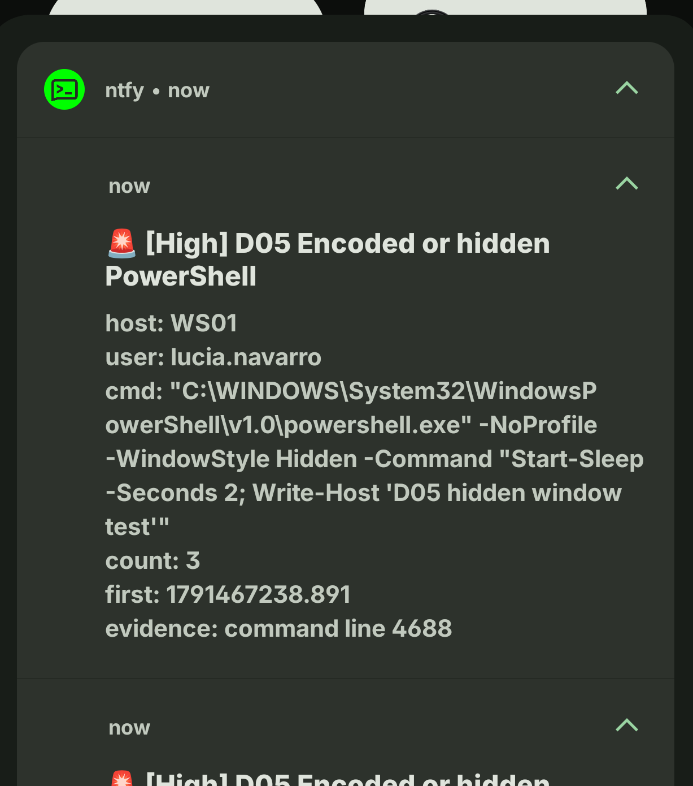
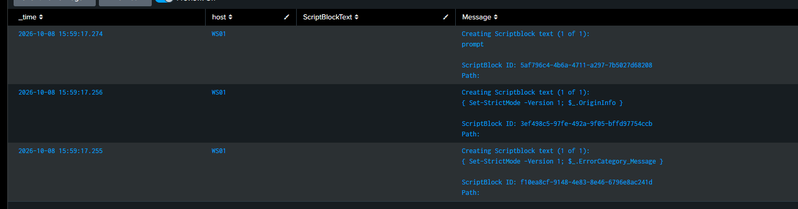

# D05: Encoded or hidden PowerShell

**ATT&CK:** T1059.001 PowerShell
**Severity:** 4 High, pages
**Source:** PowerShell Operational 4104, Security 4688, index=wineventlog

## What it catches

PowerShell started in a way meant to hide what it runs. The two tells are an encoded command (base64 behind -EncodedCommand) and a hidden window (-WindowStyle Hidden). Both are everywhere in real intrusions.

## The search

```
(index=wineventlog EventCode=4104 (Message="*frombase64string*" OR Message="*gnirtS46esaBmorF*" OR ScriptBlockText="*frombase64string*" OR ScriptBlockText="*gnirtS46esaBmorF*"))
OR (index=wineventlog EventCode=4688 (Process_Command_Line="*-enc *" OR Process_Command_Line="*-encodedcommand*" OR Process_Command_Line="* -w hidden*" OR Process_Command_Line="*-windowstyle hidden*" OR Process_Command_Line="*frombase64string*" OR CommandLine="*-enc *" OR CommandLine="*-encodedcommand*" OR CommandLine="* -w hidden*" OR CommandLine="*-windowstyle hidden*" OR CommandLine="*frombase64string*"))
| eval user=coalesce(user, src_user, Account_Name)
| eval cmd=coalesce(Process_Command_Line, CommandLine, ScriptBlockText, Message)
| eval evidence=if(EventCode=4104, "script block 4104", "command line 4688")
| search NOT user="*$"
| stats count min(_time) as first values(evidence) as evidence by host, user, cmd
| eval time=strftime(first, "%F %T")
```

The 4688 half reads `Process_Command_Line`, not `CommandLine`. On my Windows TA the `CommandLine` field is empty and the command line lands in `Process_Command_Line`. I keep both in the filter so it still works on a box that logs it the other way. The 4104 half has the same quirk: the script text lands in `Message`, not `ScriptBlockText`, so the filter reads `Message` too. See "how I tested it" for how I found both the hard way.

I dropped the `-e ` short form clause. `-e ` is a legal abbreviation of `-EncodedCommand`, but against `Process_Command_Line` it matched nearly every `svchost.exe -k ... -p -s ...` line on the machine, which is most of what a Windows box does all day. The full switches (`-enc`, `-encodedcommand`, `-windowstyle hidden`) still catch the real thing. The cost of dropping it is in "what it misses".

## What a false positive looks like

This one is a tuning job, not something you just switch on, and the baseline read is where the work is. On a quiet lab the fixed search is clean, but the raw command line stream underneath it is nearly all Windows talking to itself: dozens of `svchost.exe -k LocalServiceNetworkRestricted -p -s ...` lines a minute, `taskhostw.exe`, `upfc.exe`. None of it is encoded or hidden, but it's why a loose clause like `-e ` is dangerous: it turns all of that into alerts.

On a real network the genuine false positives are software that legitimately hides its PowerShell: installers and package managers (Chocolatey), some Microsoft components, update and management agents (SCCM-style). They run encoded or hidden on purpose. You don't widen the detection for them, you exclude the exact repeated command with a `NOT cmd="*thatstring*"` line once you've seen it in the baseline. That exclusion list is the detection, really.

## What it misses

- **Encoding that isn't base64.** gzip, XOR, or custom wrappers don't contain `frombase64string` and don't use `-EncodedCommand`, so none of my clauses see them.
- **Hiding that doesn't use the obvious switches.** There are many ways to run PowerShell quietly that never touch `-WindowStyle Hidden`.
- **The `-e ` short form.** Because I dropped that clause for noise, someone using `powershell -e <base64>` instead of the full `-EncodedCommand` slips past the 4688 half. The 4104 half still catches it if the decoded script contains `FromBase64String`, but not otherwise.
- **PowerShell run through another host process.** A payload hosted by something other than `powershell.exe` may never raise a clean 4688 with these switches on the command line.
- **A machine that logs the command line under yet another field name.** My filter covers `Process_Command_Line` and `CommandLine`; a box that uses neither would go unseen. This is the trap that bit me, so it's worth naming.

## How I tested it

Three PowerShell commands on WS01, inside the `clean - six detections` snapshot: one `-EncodedCommand` (base64 of a harmless `Write-Host`), one `-WindowStyle Hidden`, and one inline `FromBase64String`. All three ran.

The first version of the detection returned **0 rows**, which was wrong, I'd just run the attack. Chasing it turned into two field bugs, one after the other.

**Bug one, the 4688 half.** The process start events were there, but when I tabled them the `CommandLine` column was empty and the whole command line sat in `Process_Command_Line`. My filter was reading `CommandLine`, so the encoded and hidden tests, which show up as 4688s, matched nothing. I pointed the filter at `Process_Command_Line`, kept `CommandLine` as a fallback, and the two came straight back and paged my phone:





**Bug two, the 4104 half.** The FromBase64String test still didn't show. That one only writes a 4104 script block, never a 4688, so the whole detection for it rode on the 4104 filter. 4104 was flowing fine, 1,419 events across the three hosts, but when I tabled it the `ScriptBlockText` field was empty and the script text was sitting in `Message`:



Same bug as the first, one field down. I pointed the 4104 filter at `Message` too, so the FromBase64String case is caught as `script block 4104`. Then I rolled WS01 back to the snapshot.

The lesson I'm keeping: a detection returning zero right after you attacked doesn't mean the attack was quiet. Before you trust the logic, table the raw events and check you're reading the field the data actually lands in. It bit me twice in this one.

## The incident that proved it

None yet.
