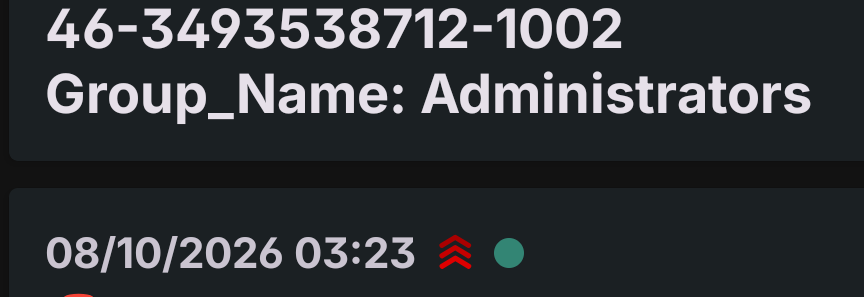

# D08: Security log cleared

**ATT&CK:** T1070.001 Indicator Removal: Clear Windows Event Logs
**Severity:** Critical (pages)
**Source:** `index=wineventlog`, event 1102

## What it catches

Someone wiping a machine's Security log.

Almost nothing legitimate does this. When it happens, the usual reason is someone covering their tracks.

## The search

```
index=wineventlog EventCode=1102
| table _time host src_user user
```

No filter. It didn't need one. The last 60 minutes had exactly one 1102, mine, and zero noise. A detection this rare and this serious should fire every time.

## Why it still works after the log is gone

This is the part I like.

I cleared WS02's Security log as the last step of the test. WS02's own copy of everything was gone: the new account, the admin change, the task. **Splunk still had all of it.** The forwarder had already shipped those events before the wipe.

And clearing the log writes one last event, 1102, saying who did it. That got shipped too.

Clearing the log on the machine doesn't touch what the SOC already has. That's the whole point of central logging.

## What a false positive looks like

An admin clearing a log while troubleshooting, or during a rebuild. Rare, and it should come with a ticket. If it doesn't, treat it as real.

## What it misses

- An attacker who **stops the forwarder or the event log service first**, then clears. No 1102 reaches Splunk. The gap would show up as silence from that host, which needs its own detection.
- Clearing other logs. Clearing the System log is event 104, not 1102.

## How I tested it

On WS02, as `.\labadmin`, after creating the D03, D04 and D07 test events and waiting a minute:

```powershell
wevtutil cl Security
```

It came back as one row: WS02, `labadmin`. My phone got it as Critical:



## The incident that proved it

None yet. Tested on purpose, not caught in the wild.
