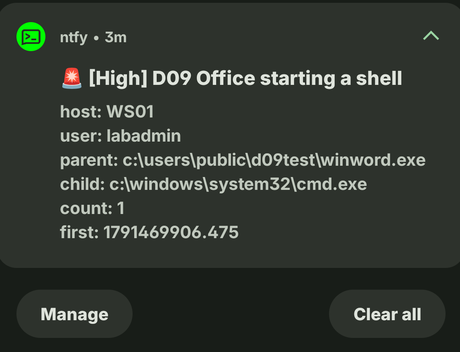

# D09: Office starting a shell

**ATT&CK:** T1204.002 Malicious File
**Severity:** 4 High, pages
**Source:** Sysmon event 1, Security 4688, index=sysmon and index=wineventlog

## What it catches

Word or Excel opening a command prompt or PowerShell. This is the classic sign of a bad attachment: the victim opens a document, a macro fires, the Office app spawns a shell. A normal document never launches cmd.exe.

## The search

```
(index=sysmon EventCode=1) OR (index=wineventlog EventCode=4688)
| eval parent=lower(coalesce(ParentImage, Parent_Process_Name, ParentProcessName))
| eval child=lower(coalesce(Image, New_Process_Name, NewProcessName))
| eval cmd=coalesce(CommandLine, Process_Command_Line)
| eval user=coalesce(user, src_user, Account_Name)
| where (like(parent, "%winword.exe") OR like(parent, "%excel.exe") OR like(parent, "%powerpnt.exe"))
| where (like(child, "%cmd.exe") OR like(child, "%powershell.exe") OR like(child, "%pwsh.exe") OR like(child, "%wscript.exe") OR like(child, "%cscript.exe") OR like(child, "%mshta.exe"))
| stats count min(_time) as first values(cmd) as cmd by host, user, parent, child
| eval time=strftime(first, "%F %T")
```

It reads two sources on purpose. Sysmon event 1 gives the cleanest parent/child pair, but the balanced config only logs some process starts. Security 4688 logs every one with its parent and full command line. So D09 fires even when Sysmon skips the event 1. My test showed both firing: one row, `count 2`, the same spawn seen twice.

## What a false positive looks like

Some environments have Office legitimately call a script, say an approved macro that runs a PowerShell reporting job. There's nothing like that in limonada.local, so any hit here is suspicious and worth a page. The alert suppresses on `host` + `child`, so a repeated spawn on one box doesn't page every minute.

## What it misses

- **Maldocs that spawn something not in my child list**, like `rundll32.exe` or `regsvr32.exe`. Plenty of real loaders use those, and they'd sail past. Widening the child list is the obvious next move, at the cost of some noise.
- **Office injecting into an existing process** instead of spawning a child. No new parent→child pair means nothing for this to match.
- **A different Office app** not in my parent list (Outlook, Access).
- **The macro engine itself was never exercised in my test.** I used the fake-parent method (below), which proves the parent→child detection logic but doesn't fire a real Word macro. A genuine maldoc could behave differently in ways I haven't seen here. To close that, I'd need Word installed and the Atomic T1204.002 route.

## How I tested it

Word isn't installed on these hosts (the "Microsoft 365" Start pin is the web stub, and `App Paths\winword.exe` is empty), so the real-macro route wasn't available without installing Office. I used **Option B, the fake parent**: copied `cmd.exe` to `C:\Users\Public\d09test\winword.exe`, then ran it so it spawned a child `cmd.exe`. A copied binary still reports its on-disk name as the parent image, so the process start logged `parent = ...\winword.exe`, which is exactly what the detection keys on.

The search returned one row: WS01, `labadmin`, parent `c:\users\public\d09test\winword.exe`, child `c:\windows\system32\cmd.exe`, `count 2` (seen by both 4688 and Sysmon event 1), command `cmd.exe /c echo D09 test from fake winword`. Then I deleted the test folder.

It also pages my phone when it fires:



## The incident that proved it

None yet. Tested on purpose, with a stand-in parent rather than a real macro.
