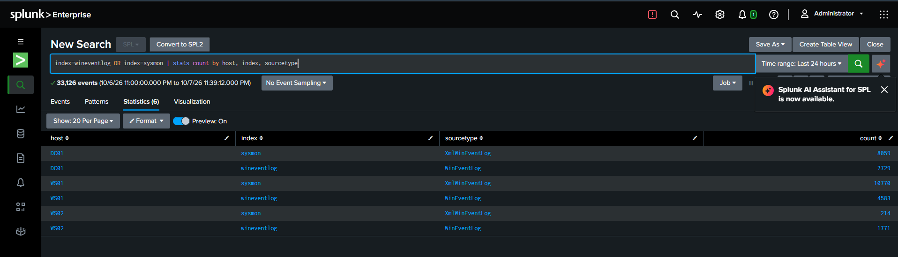

# Data sources

Before a guard starts a night shift, they walk past every camera and check it's actually recording. This page is that walk. A log source only counts once I've seen its events land in Splunk **and** split into fields I can search on, like `user` or `src_ip`. Raw text that I can't filter on doesn't count.

## The inventory

| Source | Hosts | Index | Sourcetype | How it gets there | Fields I checked | Status |
| --- | --- | --- | --- | --- | --- | --- |
| Windows Security log | DC01, WS01, WS02 | `wineventlog` | `WinEventLog` | Universal Forwarder | `host`, `user`, `src_ip`, `Logon_Type` on logons (4624) | Working |
| Windows System and Application logs | DC01, WS01, WS02 | `wineventlog` | `WinEventLog` | Universal Forwarder | `host` | Working |
| PowerShell Operational log | DC01, WS01, WS02 | `wineventlog` | `WinEventLog` | Universal Forwarder | Script text (4104), checked in Phase 5 | Arriving |
| Sysmon | DC01, WS01, WS02 | `sysmon` | `XmlWinEventLog` | Universal Forwarder | `host`, `user`, `parent_process_name`, `process_name` on process starts (1) | Working |
| ModSecurity audit log | WEB01 | `waf` | | HTTP Event Collector | | Comes with WEB01 |
| Linux auth log | WEB01 | `linux` | | HTTP Event Collector | | Comes with WEB01 |

In the first hour after the forwarders went on, Splunk took in about 33,000 events from the three Windows machines.

## How the logs travel

The VMs live on VMware's private lab network (`10.10.10.0/24`). Each one runs the Splunk Universal Forwarder, which sends to `10.10.10.1:9997`, the PC's own address on that network. Docker passes it on to Splunk.

A firewall rule on the PC lets only the lab network reach port 9997. Nothing on my home network can.

## What I noticed while checking

**Logons tell you the shape of the network.** The 4624 search showed WS01 (`10.10.10.21`) and WS02 (`10.10.10.22`) logging in to DC01, which is how domain machines fetch their policies. Names ending in `$` are computer accounts, not people. A source IP of `127.0.0.1` or `::1` means the machine logged in to itself.

**Sysmon only records the process starts worth looking at.** The balanced sysmon-modular config skips everyday programs and keeps the suspicious ones: Office starting a shell, `FromBase64` in a command line, tools that live off the land. That keeps the `sysmon` index readable. Every process start still gets logged by Windows as event 4688, with its full command line, thanks to the logging GPO. So I have the full list in one place and the interesting ones in the other.

**Logon types matter.** Type 2 is someone at the keyboard, type 3 is over the network, type 7 is unlocking the screen. A password spray shows up as a pile of failed type 3 logons, which is what detection D02 will look for.
